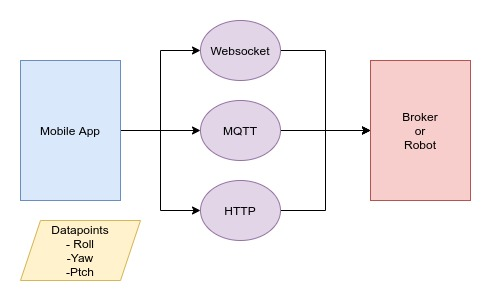
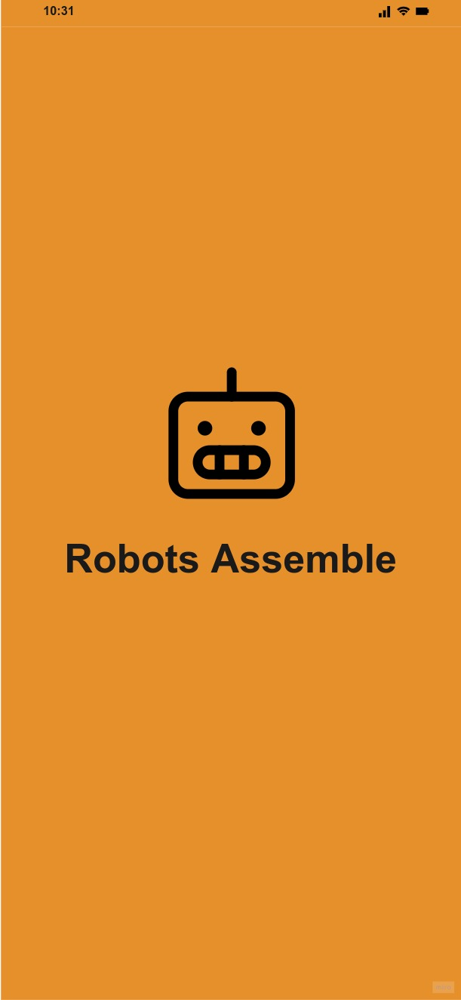
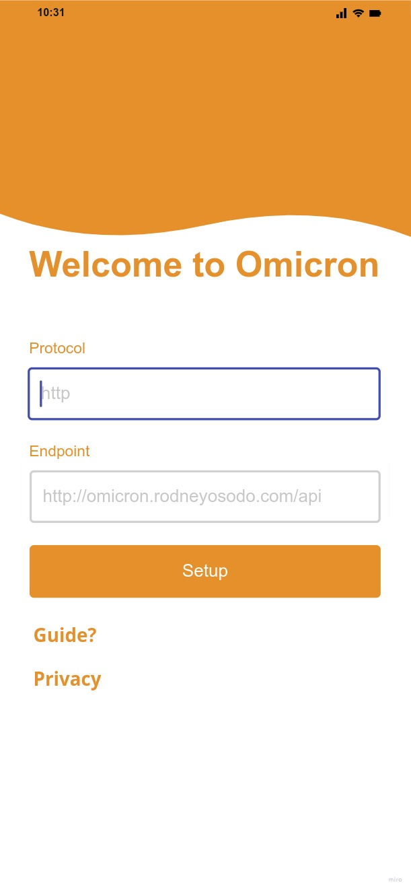
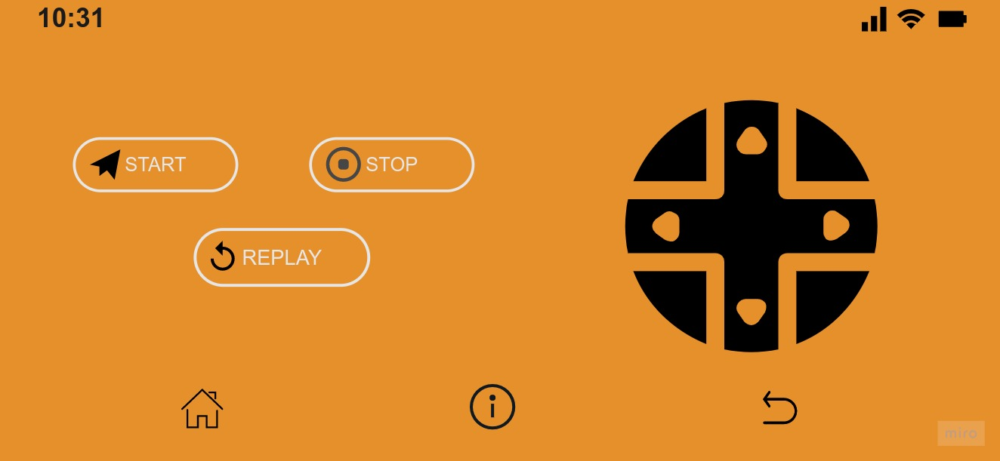

# Omicron Mobile Application

This is omicron mobile application used to control the omicron mobile platform. We intend to increase its capabilities to control other mobile robots. With this application we ensure that we get the control signals inform of roll, yaw and pitch from the mobile phone accelerometer and the joystick inbuilt on the applications. These signals are then sent via websocket, mqtt or http to your broker or mobile platform. The figure below shows the mobile application architecture to the robotic system

## App preview

## Installation

- Add [Flutter](https://flutter.dev/docs/get-started/install) to your machine

- Open this project folder with Terminal/CMD and run `flutter pub get`

- Run `flutter run` to build and run the debug app on your emulator/phone

For help getting started with Flutter development, view the
[online documentation](https://docs.flutter.dev/), which offers tutorials,
samples, guidance on mobile development, and a full API reference.

## Todos

- [x] Welcome Screen
- [x] Setup Screen
- [x] Control Screen
- [ ] Add validation on setup screen
- [ ] Establish http, ws or mqtt connection to endpoint from setup
- [ ] Setup pages for privacy policy
- [ ] Setup pages for guides
- [ ] Get roll, yaw and pitch values from joystick
- [ ] Get roll, yaw and pitch values from mobile phone accelerometer
- [ ] Send roll, yaw and pitch values
- [ ] Setup start recording commands for a replay
- [ ] Setup stop recording commands for a replay
- [ ] Setup replay for stored command

## Thanks

- [Flutter](https://flutter.dev) for the great cross platform framework

## License

See [LICENSE](LICENSE).
